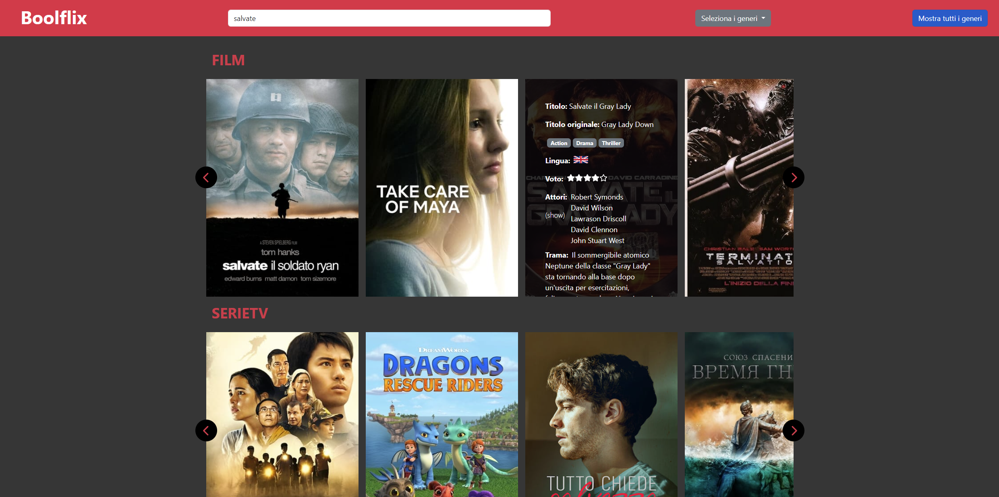
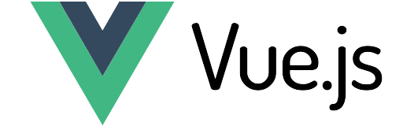

<h3 align="center">Boolflix</h3>
<div align="center">

<p>A movie catalogue</p>
</div>

<!-- ABOUT THE PROJECT -->
## About The Project


This is a simply movie catalogue that use the API provided by themoviedb.org, built with: ,  , 

This catalogue currently allows you to:

* search for a movie or series by name
* vread the details of a specific title
* filter results by genre

<!-- GETTING STARTED -->
## Getting Started

### Installation

1. Clone the repo
   ```sh
   git clone https://github.com/mazzocchifrancesco/vite-boolflix.git
   ```
2. Install NPM packages
   ```sh
   npm install
   ```